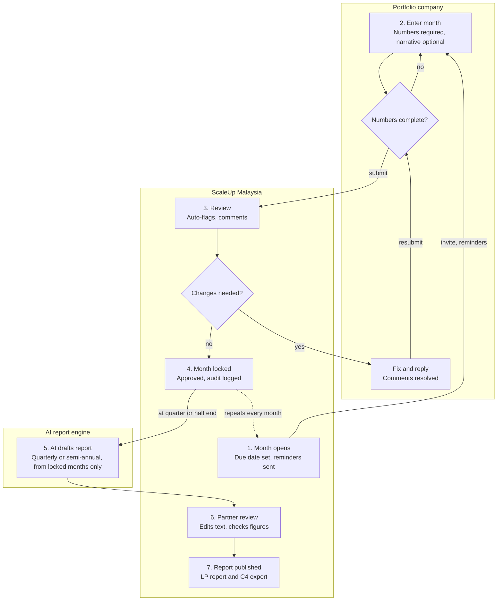

# ScaleUp Portfolio Reporting Platform: BRD

30 Sep 2026 · Kenneth Siew

## 1. Purpose

This BRD defines a web platform that replaces ScaleUp Malaysia's spreadsheet and email based portfolio reporting. Portfolio companies submit monthly data online using the existing C4 categories; ScaleUp approves it, and AI drafts quarterly and semi-annual reports from the approved data.

| Item            | Detail                                                                                                             |
|-----------------|--------------------------------------------------------------------------------------------------------------------|
| Version         | 0.2 (draft; updated during the Phase 1 build, see §13 Build decisions)                                             |
| Business owner  | ScaleUp Malaysia, Investment team                                                                                  |
| Funds covered   | ScaleUp Ventures 1 Sdn Bhd (SV1), ScaleUp Founders Fund LP (SFF)                                                   |
| Reporting basis | Monthly company updates (numbers mandatory, narrative optional); quarterly and semi-annual reports generated by AI |
| Users           | ScaleUp admins and partners; portfolio company founders and finance leads                                          |

## 2. Current method and pain points

Today each company's data sits in a per-company Excel workbook built on the C4 template, fed by founder emails, meeting notes and monthly management accounts. Partners then write a narrative update per company, which is compiled into the fund's LP report.

**Current reporting components (to be preserved):**

| Component              | Format today                                                                                              | Content                                                                                                                                                                                    |
|------------------------|-----------------------------------------------------------------------------------------------------------|--------------------------------------------------------------------------------------------------------------------------------------------------------------------------------------------|
| Monthly founder update | Google Form, exported to Excel (e.g. BB Report)                                                           | Key milestones; sales, marketing, partnerships, product, operations and team highlights; team morale rating; next month goals; help needed; total revenue, GP, NP, cash in bank, burn rate |
| C4 semi-annual sheet   | Per-company workbook, 8 category rows by half-year columns, with Last Updated row and "Input Here" column | Revenue and Financial Metrics; Partnerships and Market Updates; Operation; Product Development; Customer Acquisition Strategies; Investment; Compliance and Regulation; Other Mentionables |
| Financial summary      | Revenue Lines tab                                                                                         | Revenue by segment, total revenue, GP and GP%, NP and NP%, cash in bank, monthly burn, YoY                                                                                                 |
| Company KPI tab        | Company-specific (e.g. Huddle Metrics, Batik Retail Per Outlet)                                           | Monthly operating KPIs (cameras deployed, games recorded), per-outlet revenue and break-even                                                                                               |
| Supporting documents   | PDF/Excel by email; meeting notes                                                                         | Management accounts (P&L, balance sheet, cash flow), partner meeting notes                                                                                                                 |
| LP report              | Markdown per company, compiled to PDF per fund                                                            | Partner-in-charge, Performance Summary, Comparison with prior half, FY Management Accounts, narrative, Fundraising and Exit Strategy, Outlook                                              |

**Pain points:**

- Data arrives late and in inconsistent formats, then is rekeyed by the ScaleUp team.
- Monthly form data and the semi-annual C4 workbook are separate, so half-year figures are rebuilt by hand; each workbook copy also drifts from the template.
- Missing figures are chased by email, with no status view across the portfolio.
- No single history of prior submissions for trend or YoY comparison.
- LP report assembly is manual; the same figure can differ between workbook and narrative.
- Two funds (SV1 and SFF) run the same process in parallel folders, duplicating effort.

## 3. Objectives and success metrics

| \#  | Objective                     | Metric                                                        | Target                                          |
|-----|-------------------------------|---------------------------------------------------------------|-------------------------------------------------|
| O1  | Companies self-report monthly | Share of companies submitting via platform                    | 100% of active portfolio by month 3             |
| O2  | No gaps in numbers            | Months with missing quantitative data                         | Zero                                            |
| O3  | Fast monthly close            | Days from month end to numbers approved                       | 20 days or less                                 |
| O4  | Cut manual rekeying           | Figures typed by ScaleUp staff per company                    | Zero for standard fields                        |
| O5  | One source of truth           | Mismatches between data and reports                           | Zero (report figures pulled from approved data) |
| O6  | AI-drafted period reports     | Time from last month locked to draft ready for partner review | 1 working day or less                           |
| O7  | Portfolio visibility          | Live status and KPI dashboard across both funds               | Available from day one                          |

## 4. Scope

**In scope**

- Multi-fund setup (SV1, SFF, future funds) with company-to-fund mapping.
- Configurable reporting templates based on C4: qualitative sections, financial summary, segment/unit tabs, monthly grid.
- Company portal for data entry, file uploads and submission.
- Admin portal for cycle management, review, comments, approval and reminders.
- Portfolio dashboards and per-company history.
- AI generation of quarterly and semi-annual reports (C4 sheet, LP narrative) from approved data; Excel/PDF exports.

**Out of scope (v1)**

- Direct integration with company accounting systems (Xero, SQL, AutoCount). Upload of management accounts only.
- Fund accounting, NAV, capital calls and LP portal.
- Cap table management and valuation modelling.
- Deal pipeline / CRM.

**Phasing**

1.  **Phase 1 (MVP):** users and roles, template builder, cycle setup, company submission, admin review and approval, Excel export. Pilot with 3 companies (e.g. Batik Boutique, RECQA, Kiddocare).
2.  **Phase 2:** portfolio dashboard, historical trend views, automated reminders, AI quarterly and semi-annual report generation.
3.  **Phase 3:** compiled fund report PDF, AI anomaly flags, accounting system connectors.

## 5. Users and roles

| Role                 | Side    | Description                                                               |
|----------------------|---------|---------------------------------------------------------------------------|
| Super Admin          | ScaleUp | Platform settings, funds, users, templates.                               |
| Fund Admin / Analyst | ScaleUp | Runs cycles, chases submissions, first-level review, exports.             |
| Partner-in-Charge    | ScaleUp | Owns assigned companies; reviews, comments, approves; edits LP narrative. |
| Viewer               | ScaleUp | Read-only dashboards and reports (e.g. IC members).                       |
| Company Owner        | Company | Founder/CEO; manages company users; signs off and submits.                |
| Company Contributor  | Company | Finance or ops lead; enters data and uploads files; cannot submit.        |

**Permissions matrix**

| Action                                                | Super Admin | Fund Admin         | Partner        | Viewer | Co. Owner                  | Co. Contributor     |
|-------------------------------------------------------|-------------|--------------------|----------------|--------|----------------------------|---------------------|
| Manage funds, companies, users, platform settings     | Yes         | No                 | No             | No     | Invite own contributors    | No                  |
| Manage templates, company KPIs, revenue lines, FX     | Yes         | Yes                | No             | No     | No                         | No                  |
| Open / close reporting cycle, extend deadlines        | Yes         | Yes                | No             | No     | No                         | No                  |
| Enter data, upload files                              | No          | On behalf (logged) | No             | No     | Yes                        | Yes                 |
| Submit / resubmit; confirm quarter or half close      | No          | Close on behalf    | No             | No     | Yes                        | No                  |
| Comment, request changes                              | Yes         | Yes                | Yes            | No     | Reply and resolve only     | Reply and resolve only |
| Approve submission                                    | Yes         | No                 | Yes (own cos.) | No     | No                         | No                  |
| Reopen an approved (locked) month, with reason        | Yes         | Yes                | Yes (own cos.) | No     | Request amendment          | No                  |
| Edit LP narrative                                     | Yes         | Yes                | Yes (own cos.) | No     | No                         | No                  |
| View dashboards                                       | All         | All                | All            | All    | Own company                | Own company         |
| Export data / reports                                 | Yes         | Yes                | Yes            | Yes    | Own submissions            | No                  |
| View audit log                                        | Yes         | Yes                | Yes            | No     | No                         | No                  |

Company users never see other companies' data or ScaleUp internal notes.

## 6. Reporting data model

Companies report monthly in one module, the **Portfolio Update**. Numbers are mandatory every month and can never be skipped; the narrative is optional. Quarterly and semi-annual reports are not filled in by companies: AI generates them from the approved monthly data (A11).

### 6.1 Monthly Portfolio Update

| Part                                              | Monthly rule              | Can a month be skipped?                                                       |
|---------------------------------------------------|---------------------------|-------------------------------------------------------------------------------|
| Quantitative: financials, headcount, company KPIs | Mandatory                 | No. A month cannot be submitted while any earlier month's numbers are missing |
| Qualitative: C4 categories, founder pulse         | Optional                  | Yes. Blank months are allowed                                                 |
| Management accounts                               | At quarter and half close | Requested at period close                                                     |

**Quantitative (mandatory each month)**

| Field                             | Unit          | Rule                                       |
|-----------------------------------|---------------|--------------------------------------------|
| Total revenue                     | RM            | Required; when the company has its own revenue segments, it equals their sum (calculated) |
| Company revenue segments          | RM            | Defined by the company owner; required where defined; add up to total revenue |
| ScaleUp revenue lines             | RM            | Defined by ScaleUp per company; required where configured; need not add up to total revenue |
| Gross profit                      | RM            | Required                                   |
| Net profit                        | RM            | Required; negative allowed                 |
| Cash in bank                      | RM, month end | Required                                   |
| Burn rate                         | RM per month  | Required; 0 if cash-flow positive          |
| Headcount (full-time, part-time)  | Number        | Required                                   |
| Company KPIs (6.2)                | As defined    | Required where configured                  |

Calculated by the platform: GP%, NP%, runway, MoM, QoQ, HoH and YoY growth, and quarter and half totals (flows summed; cash and headcount at period end; burn rate shown as the average monthly burn for the period). Runway is cash divided by monthly burn; a burn of 0 is shown as "cash-flow positive".

Revenue is broken down two ways (B30):

- **Company revenue segments**: the company owner defines their own segments once in the portal; they add up to total revenue, which is calculated from them, and carry over every month for continuity. Changing them (add, rename, remove) warns the owner that it may affect reporting standards and comparability with earlier months; months already submitted keep their segment names and figures. A company with no segments of its own enters total revenue directly.
- **ScaleUp revenue lines**: ScaleUp defines lines per company with names that suit that company (e.g. AOneSchools SaaS, AOnePay). They are reported every month but do not have to add up to total revenue.

**Qualitative (optional each month)**

| C4 category                     | What goes in (from the old monthly form)     |
|---------------------------------|----------------------------------------------|
| Company Summary                 | Key milestones                               |
| Revenue and Financial Metrics   | Commentary on the month's numbers            |
| Partnerships and Market Updates | Partnerships                                 |
| Operation                       | Operations highlights, team highlights       |
| Product Development             | Product highlights                           |
| Customer Acquisition Strategies | Sales highlights, marketing highlights       |
| Investment                      | Fundraising status (picklist) and commentary |
| Compliance and Regulation       | Licences, regulatory matters                 |
| Other Mentionables              | Anything else                                |

Founder pulse: team morale (1 to 5), next month goals, help needed from ScaleUp (tagged).

**When a month opens:** each company reports from its own reporting start month (default July 2026, the start of H2 2026; earlier history comes from the workbook migration). A month opens on the 1st of the following month.

**Missing or late numbers:** each month's numbers are due by a day set by admin (e.g. the 15th of the following month). A month that opens after its normal due date (for example when a company is onboarded mid-year) gets 14 days from opening. Overdue months show red on the tracker, trigger reminders and escalate to the partner-in-charge after 14 days. Months are submitted in order: a month can only be submitted once every earlier month has been submitted.

**Changing a locked month:** the company owner requests an amendment with a reason, or ScaleUp reopens the month with a reason. The company corrects and resubmits, and the month needs approval again. Every step is logged.

**Period close:** at each quarter and half end, the company confirms the period totals and uploads management accounts. Totals can be restated to the management accounts, with a reason recorded. Confirmation needs every month of the period submitted and at least one management accounts file. Quarters and halves follow the calendar year (Q1 = Jan to Mar; H1 = Jan to Jun).

### 6.2 Company-specific KPIs

Admins define extra metrics per company, each with name, unit, frequency (monthly or half-yearly) and dimension (e.g. per outlet, per product). Half-yearly KPIs are collected in the June and December updates. Examples from current workbooks:

- Batik Boutique: revenue per outlet (Mont Kiara, The Row, IOI City Mall, Westin Desaru, Merdeka 118), monthly break-even, profitable (Y/N).
- Huddle: cameras deployed, games recorded, games per camera, games broken down for statistics.
- Kiddocare: app downloads, bookings, active carers, payouts to carers.

### 6.3 ScaleUp internal fields (not visible to companies)

Partner-in-charge, partner meeting notes, exit strategy status and thread (carried forward each half), internal rating (on track, watch, at risk), and the LP narrative draft.

## 7. Reporting cycle workflow

Each month, a company cannot submit until its numbers are complete; the narrative can be left blank. At quarter end (31 Mar, 30 Jun, 30 Sep, 31 Dec) and half end, AI drafts the period report from locked months only, and a partner approves it before release.

## 8. Platform functions: ScaleUp admin portal

| ID  | Module                          | Functions                                                                                                                                                                                                                                                                                                                                                                                                                                                                                                                                                                                          | Phase |
|-----|---------------------------------|----------------------------------------------------------------------------------------------------------------------------------------------------------------------------------------------------------------------------------------------------------------------------------------------------------------------------------------------------------------------------------------------------------------------------------------------------------------------------------------------------------------------------------------------------------------------------------------------------|-------|
| A1  | Fund and portfolio setup        | Create funds (SV1, SFF); add companies with legal entity, sector, partner-in-charge and reporting start month; map a company to one or more funds, recording investment date, instrument and ownership % per fund (a company can sit in both SV1 and SFF); mark exited or written off (history kept, company becomes read-only)                                                                                                                                                                                                                                                              | 1     |
| A2  | User management                 | Invite ScaleUp users and company owners; assign roles; deactivate; 2FA enforcement                                                                                                                                                                                                                                                                                                                                                                                                                                                                                                                 | 1     |
| A3  | Template builder                | Maintain the master Portfolio Update template (C4 based); add, rename, reorder categories and fields; set required flags and validation; version templates so past cycles keep their original form                                                                                                                                                                                                                                                                                                                                                                                                 | 1     |
| A4  | Company KPI builder             | Add company-specific metrics and dimensions (e.g. outlets, products); set units and frequency                                                                                                                                                                                                                                                                                                                                                                                                                                                                                                      | 1     |
| A5  | Cycle management                | Monthly cycles open automatically; set the due day (e.g. 15th of the following month); define quarter and half periods; extend deadline per company; lock approved months                                                                                                                                                                                                                                                                                                                                                                                                                          | 1     |
| A6  | Submission tracker              | Portfolio grid: company by month; numbers status (missing, submitted, changes requested, approved) with overdue in red; narrative filled or skipped                                                                                                                                                                                                                                                                                                                                                                                                                                                | 1     |
| A7  | Review and approval             | Side-by-side view vs prior month and same month last year; auto-flags (revenue swing over 30%, cash under 6 months runway, blank required fields); field-level comments; request changes; approve                                                                                                                                                                                                                                                                                                                                                                                                  | 1     |
| A8  | Reminders                       | Scheduled email reminders (e.g. 7 days before, on due date, weekly overdue); manual nudge; message templates                                                                                                                                                                                                                                                                                                                                                                                                                                                                                       | 2     |
| A9  | Internal notes and exit tracker | Partner meeting notes, upload of meeting transcripts, exit strategy thread carried forward each half, internal rating                                                                                                                                                                                                                                                                                                                                                                                                                                                                              | 2     |
| A10 | Portfolio dashboard             | Fund and company KPIs: revenue, growth, GP%, NP%, cash, runway, burn; trend charts; filters by fund, sector, partner                                                                                                                                                                                                                                                                                                                                                                                                                                                                               | 2     |
| A11 | AI report generator             | Pick company(ies), period (quarter or half) and output (C4 sheet, LP narrative, one-pager). AI reads locked monthly numbers, KPIs, monthly narrative, management accounts, partner notes, exit thread and the prior period's report, then writes in house style (Performance Summary, Comparison with prior period, narrative, Fundraising and Exit Strategy, Outlook). Figures come from data only, never invented; each statement links to its source month; months with no narrative are stated, not filled; RM[___] where data is missing. Partner edits, regenerates a section, approves | 2     |
| A12 | Report compiler                 | Assemble per-fund report with cover and Message from the Partners (AI first draft); export PDF and Word                                                                                                                                                                                                                                                                                                                                                                                                                                                                                            | 3     |
| A13 | Exports                         | C4 workbook per company (same layout as today), portfolio data in Excel/CSV, document pack download                                                                                                                                                                                                                                                                                                                                                                                                                                                                                                | 1     |
| A14 | Audit log                       | Every change, submission, approval and on-behalf entry with user and timestamp                                                                                                                                                                                                                                                                                                                                                                                                                                                                                                                     | 1     |

## 9. Platform functions: company portal

| ID  | Module                    | Functions                                                                                                                                                                                                    | Phase |
|-----|---------------------------|--------------------------------------------------------------------------------------------------------------------------------------------------------------------------------------------------------------|-------|
| C1  | Login and team            | Email login with 2FA; owner invites contributors (finance, ops); multi-company login for founders with more than one investee                                                                                | 1     |
| C2  | Home                      | This month's update with due date; any month with missing numbers flagged red; outstanding change requests; last submitted figures                                                                           | 1     |
| C3  | Monthly update form       | Numbers section (mandatory): financials, headcount, company KPIs, validated before submit. Narrative section (optional): C4 categories and founder pulse, previous month's entries shown alongside. Autosave | 1     |
| C4  | Document upload           | At quarter and half close: confirm period totals and upload management accounts (PDF, Excel); version history                                                                                                | 1     |
| C5  | Bulk import               | Download a pre-formatted Excel template, fill offline, upload to populate the form                                                                                                                           | 2     |
| C6  | Review and submit         | Numbers check (submit blocked while any month's numbers are missing); owner declaration ("figures are accurate to the best of my knowledge"); submit; resubmit after changes requested                       | 1     |
| C7  | Comments                  | See ScaleUp comments at field level; reply; mark resolved                                                                                                                                                    | 1     |
| C8  | Help requests             | Raise an ask to ScaleUp any time, outside the update cycle; track response                                                                                                                                   | 2     |
| C9  | Own history and dashboard | View past submissions; trend charts of own revenue, margin, cash and KPIs; export own data                                                                                                                   | 2     |

Companies see only their own data. Internal notes, ratings, exit threads and LP narrative drafts are never shown on the company side.

## 10. Outputs

| Output                                                                     | Audience          | Content                                                                                        | Format     |
|----------------------------------------------------------------------------|-------------------|------------------------------------------------------------------------------------------------|------------|
| C4 workbook export                                                         | ScaleUp team      | Same layout as today: C4 sheet, Revenue Lines, company KPI tab, monthly grid                   | Excel      |
| Portfolio dashboard                                                        | Partners, IC      | Status tracker, KPI table and trends by fund and company                                       | In-app     |
| Company one-pager                                                          | Partners, IC      | Latest half financials, KPIs, C4 highlights, flags                                             | PDF        |
| Quarterly or semi-annual report per company (AI-drafted, partner-approved) | LPs (via report)  | House style: prose only, British spelling, about 1,100 to 1,400 words, closes on exit strategy | Word, PDF  |
| Compiled fund report                                                       | LPs               | Cover, Message from the Partners, all company updates, per fund (SV1, SFF)                     | PDF, Word  |
| Data extract                                                               | Finance, auditors | All approved figures by company and period                                                     | Excel, CSV |

Every figure in an LP output is pulled from approved data, never retyped. Where data is missing, the draft shows RM[___] and a "To finalise" note.

## 11. Non-functional requirements

| Area            | Requirement                                                                                                                                                                             |
|-----------------|-----------------------------------------------------------------------------------------------------------------------------------------------------------------------------------------|
| Access control  | Role-based access; strict tenant isolation per company; 2FA for all users; session timeout 30 minutes                                                                                   |
| Data protection | Compliant with Malaysia PDPA 2010 (as amended 2024); data hosted in Malaysia or Singapore region; encryption in transit (TLS 1.2+) and at rest                                          |
| Confidentiality | Company data treated as confidential investee information; NDA-aligned terms of use accepted at first login                                                                             |
| Audit           | Immutable audit log of edits, submissions, approvals and exports; retained for 7 years                                                                                                  |
| Availability    | 99.5% monthly uptime; daily backups, 30-day retention; restore tested each quarter                                                                                                      |
| Performance     | Pages load in under 3 seconds; exports of a full fund complete in under 60 seconds                                                                                                      |
| Usability       | Desktop first, mobile responsive for review and approvals; English UI                                                                                                                   |
| Scale           | 2 funds, about 30 companies and 100 users at launch; design for 5 funds and 150 companies                                                                                               |
| Data retention  | Exited companies' data kept read-only; deletion only by Super Admin with logged reason                                                                                                  |
| AI              | Enterprise LLM with no training on ScaleUp or company data; data processed in an approved region; prompts, sources and outputs logged; AI output stays a draft until a partner approves |

## 12. Assumptions, risks and open items

**Assumptions**

- All figures in RM; non-Malaysian entities (e.g. iMotorbike Pte Ltd) enter in their reporting currency with a period FX rate set by admin.
- Companies report monthly: numbers mandatory, narrative optional. AI reports state which months had no narrative instead of filling the gap.
- Historical data (H2 2024 to H1 2026) is migrated from existing C4 workbooks at launch.

**Risks**

| Risk                               | Mitigation                                                                                                                         |
|------------------------------------|------------------------------------------------------------------------------------------------------------------------------------|
| Founders resist a new tool         | Keep fields identical to the Google Form and C4; Excel bulk import; pilot with 3 engaged companies first                           |
| Data quality varies                | Validation rules, auto-flags, required management accounts upload                                                                  |
| Template changes break history     | Template versioning per cycle                                                                                                      |
| Confidential data exposure         | Tenant isolation, 2FA, audit log, PDPA-aligned hosting                                                                             |
| AI writes wrong or invented facts  | Figures inserted from data only; source month shown per statement; RM[___] for gaps; partner approval required before release |
| Thin narrative from skipped months | AI flags narrative coverage per period; partner adds meeting notes before generating                                               |

**Open items**

- [x] Build vs buy: custom build chosen for the pilot (see §13, B1).
- [ ] Confirm whether companies also see the approved LP narrative about them before release.
- [ ] Confirm final list of active companies per fund for migration. A draft list from the H1 2026 fund reports is in Appendix A. Also confirm whether exited companies such as ATX should be loaded for history.
- [ ] Agree standard auto-flag thresholds (revenue swing, runway). Defaults are set and adjustable in Settings (§13, B12).
- [ ] Assign product owner and budget.
- [x] C4 export layout: follows the fields in this BRD (§6.1 and §10). A sample workbook is not needed (§13, B17).
- [ ] For each pilot company, confirm investment date, instrument, ownership %, sector, revenue lines and KPIs (RECQA KPIs are not yet defined). Funds and partners-in-charge are taken from the H1 2026 reports (Appendix A).
- [ ] Legal to supply the terms of use / NDA wording shown at first login (a draft placeholder is in the build).
- [ ] Choose the email provider for invitations and reminders (Phase 2); v1 uses copyable invite links.
- [ ] Backups: the Supabase Pro plan keeps 7 days of daily backups. Meeting the 30-day retention target needs the point-in-time recovery add-on or a scheduled off-site backup.
- [ ] Should Fund Admins also be able to add companies and invite company owners? Currently Super Admin only, per the permissions matrix.

## 13. Build decisions (v0.2)

Decisions taken while building Phase 1 that clarify or streamline this BRD. Items marked "confirm" need a business sign-off.

| \#  | Decision                                                                                                                                                                                                                      | Affects |
|-----|-------------------------------------------------------------------------------------------------------------------------------------------------------------------------------------------------------------------------------|---------|
| B1  | Custom build on Next.js with Supabase (managed Postgres database, login with 2FA, private file storage) hosted in the Singapore region, which meets the PDPA hosting requirement.                                            | §11, §12 |
| B2  | Investment date, instrument and ownership % are recorded per fund, because one company can be held by both SV1 and SFF.                                                                                                        | A1      |
| B3  | Each company has a reporting start month (default July 2026). Months before that come from the historical workbook migration.                                                                                                 | §6.1    |
| B4  | A month opens on the 1st of the following month and is due on the admin-set day (default the 15th). A month that opens late gets 14 days from opening.                                                                        | §6.1, A5 |
| B5  | Months are submitted in order: a month can only be submitted once every earlier month has been submitted. This is how "numbers can never be skipped" is enforced.                                                             | §6.1, C6 |
| B6  | Quarters and halves follow the calendar year for all companies in v1. Period totals sum revenue, GP and NP, take cash and headcount at period end, and average the burn rate.                                                  | §6.1    |
| B7  | ScaleUp comments are either Shared (the company sees and replies) or Internal (ScaleUp only). Company users reply to and resolve threads but do not open new ones.                                                             | A7, C7  |
| B8  | Changing a locked month: the company owner requests an amendment, or ScaleUp (Super Admin, Fund Admin or the partner-in-charge) reopens with a reason. The company resubmits and the month is approved again.                    | §6.1    |
| B9  | Approval: the partner-in-charge or a Super Admin approves. Any partner can comment and request changes. Fund Admins can reopen but not approve.                                                                                 | §5      |
| B10 | Super Admin manages funds, companies, users and platform settings. Fund Admin manages templates, company KPIs, revenue lines, FX rates, cycles and deadlines. Confirm (see open items).                                        | §5, A1 to A5 |
| B11 | 2FA uses an authenticator app (TOTP) for every user and is also enforced at database level. A Super Admin can reset a user's 2FA. Sessions end after 30 minutes of inactivity, with a warning 2 minutes before.                 | §11, A2 |
| B12 | Auto-flag defaults: revenue change over 30% month-on-month (critical over 60%), runway under 6 months (critical under 3), negative cash, blank required fields. Thresholds are editable in Settings. Confirm.                    | A7      |
| B13 | Confirming a quarter or half close requires every month of the period to be submitted and at least one management accounts file uploaded.                                                                                     | §6.1, C4 |
| B14 | Invitations in v1 are secure single-use links, valid for 7 days, that the admin copies and sends. The link opens an "Accept invitation" page, so email link-scanners cannot use it up. Admins can revoke an invite or issue a new sign-in link. Automated emails arrive with reminders in Phase 2. | A2, C1, A8 |
| B15 | Exited or written-off companies become read-only and stop receiving new months. Their history is kept.                                                                                                                         | A1, §11 |
| B16 | The whole portfolio (Appendix A) is loaded at launch. A company starts monthly reporting only once ScaleUp sets its reporting start month; until then it shows "Not yet reporting". The pilot (Batik Boutique, RECQA, Kiddocare) reports from July 2026. | §4, A1  |
| B17 | The C4 workbook export and the monthly form follow the field lists in this BRD (§6.1 C4 categories and quantitative fields, §6.2 KPIs, §10 outputs) rather than any individual legacy workbook. | A13, C3 |
| B18 | Non-MYR companies report in their own currency (i-Motorbike reports in USD, per the H1 2026 SFF report). Dashboards and exports convert to RM using the admin-set monthly FX rate. | §12     |
| B19 | A month that ScaleUp sends back or reopens gets at least 14 days from that day to be corrected and resubmitted.                                                                                                                 | §6.1, A7 |
| B20 | Sending back a month that sits in a confirmed quarter or half reopens that period close. The company confirms it again after resubmitting.                                                                                     | §6.1, C4 |
| B21 | Exited and written-off companies are read-only for their users and for Fund Admin on-behalf work. ScaleUp can still approve months already submitted, but cannot send them back.                                                | A1, §11 |
| B22 | Users with any history (submissions, approvals, comments, uploads) are deactivated and blocked from signing in, never deleted, so the audit trail stays complete.                                                            | A2, A14 |
| B23 | Until the email provider is set up (Phase 2), a user who forgets their password asks ScaleUp, who issues a new sign-in link (valid 24 hours).                                                                                 | A2      |
| B24 | Partner-in-charge is a ScaleUp-internal field, as in §6.3: the assignment is not shown on the company side. Founders do see the names of the ScaleUp people who comment on or approve their months (B28). | §6.3, C2 |
| B25 | The terms of use must be accepted before any data is visible. This is enforced by the database, not only the screens. Changing the terms version makes every user accept again.                                                | §11     |
| B26 | Validation limits set in the template (no negatives, minimum and maximum values) apply to the core figures too.                                                                                                                | A3      |
| B27 | Company users see only the settings they need (due day, declaration wording, terms version). Auto-flag thresholds and escalation rules stay internal to ScaleUp.                                                                 | A7, §5  |
| B28 | On the company side, ScaleUp people are shown by name with a "(ScaleUp)" label, e.g. "Renuka Sena (ScaleUp)", on comments, timelines, approvals and documents. Their email addresses and roles are not shown. Decided 1 Oct 2026. | B24, A7, C7 |
| B29 | Company owners can invite new contributors, up to 4 active contributors per company (pending invitations count); ScaleUp can add more when needed. The limit is a Super Admin setting. Owners receive links only for people who belong to no other company; anyone who already has an account is simply added to the team and signs in as usual, or ScaleUp issues them a link. Decided 1 Oct 2026. | B14, B23, C1 |
| B30 | Two revenue breakdowns. Company owners define their own revenue segments in the portal; these add up to total revenue (calculated) and are reused every month. ScaleUp admins define separate revenue lines per company that need not add up to total revenue. Changing company segments warns about comparability; a renamed segment starts a new series, months not yet submitted switch to the new set, and submitted months keep their segment names and figures. Decided 1 Oct 2026. | §6.1, A4, C3 |
| B31 | Company KPIs follow the same concept as revenue segments (B30). ScaleUp Required KPIs are set by ScaleUp per company (may be per outlet or product, monthly or half-yearly). Every company starts with one default ScaleUp Required KPI, "Active Customers" (whole number, monthly); the default list for new companies is a ScaleUp admin setting, and admins can rename, remove or add KPIs per company. Self Defined KPIs are added by the company owner with an "Add KPI" button in the portal and reused every month, with the same comparability warning and history rules as segments; they are required while active, monthly, single value, of type number, whole number, RM, % or yes/no. Decided 1 Oct 2026. | §6.2, A4, C3 |
| B32 | A company's reporting start month can be set from the platform default (July 2026) up to 12 months ahead. Earlier months (H2 2024 to H1 2026) are loaded by ScaleUp with the historical workbook import tool, as approved months. | §6.1, §12, A1 |
| B33 | A company's reporting currency is locked once it has figures; a KPI's type and dimension are locked once it has figures. Deleting a company (Super Admin, with reason) also deletes its stored files. | A1, A4   |
| B34 | Deadline extensions cannot be set in the past or more than 12 months ahead. Draft months from before a reporting start month that was moved later are shown as "Not required". | A5       |
| B35 | The due day and the grace period for late-opened months are Super Admin platform settings; Fund Admins open months early and extend deadlines. Confirm. | A5, B10  |
| B36 | A sign-in link for an existing user leads through 2FA to choosing a new password. Company owners can revoke only links sent by their own company's owners. A person who already has an account is added to a team without a link. | A2, C1, B23 |
| B37 | Period close: when totals are restated, GP% and NP% are derived from the restated revenue and profit. A confirmed close still accepts new versions of its documents. Every document download is logged. | C4, A14  |
| B38 | Revenue segments: a renamed segment that has no submitted figures yet is renamed in place and keeps its history; only segments already used in a submitted month start a new series. Reordering alone does not trigger the comparability warning. | B30      |
| B39 | Publishing a template version requires release notes. Templates are visible to Super Admins and Fund Admins only. | A3       |
| B40 | 2FA cannot be switched off platform-wide (B11). The Settings switch is removed; a locked-out user gets a 2FA reset from a Super Admin instead. Confirm. | §11, B11, A2 |

## Appendix A. Portfolio at launch (from the H1 2026 fund reports)

Draft for confirmation (open item). Partners-in-charge are assigned in the platform once each partner's account is created.

| Fund | Company                       | Partner-in-charge (H1 2026 report) | Platform status at launch                                           |
|------|-------------------------------|------------------------------------|---------------------------------------------------------------------|
| SV1  | AOne (formerly AOne Schools)  | Aaron Sarma                        | Not yet reporting                                                   |
| SV1  | Agiliux                       | Dr. Sivapalan Vivekarajah          | Not yet reporting                                                   |
| SV1  | BiiB                          | Xelia Tong                         | Not yet reporting                                                   |
| SV1  | Batik Boutique                | Renuka Sena                        | **Pilot**, reports from July 2026                                   |
| SV1  | IIMMPACT                      | Tay Shan Li                        | Not yet reporting                                                   |
| SV1  | TixCarte                      | Dr. Sivapalan Vivekarajah          | Not yet reporting                                                   |
| SV1  | RECQA                         | Renuka Sena                        | **Pilot**, reports from July 2026                                   |
| SFF  | Buzz (formerly BeeBag)        | Aaron Sarma                        | Not yet reporting                                                   |
| SFF  | Docspe / Plexis.ai            | Andre Sequerah                     | Not yet reporting                                                   |
| SFF  | Huddle                        | Renuka Sena                        | Not yet reporting (KPIs from §6.2 pre-configured)                    |
| SFF  | Kabel                         | Xelia Tong                         | Not yet reporting                                                   |
| SFF  | StayHere                      | Tay Shan Li                        | Written off (fully impaired; voluntary strike-off in progress)      |
| SFF  | Petotum                       | Tay Shan Li                        | Not yet reporting                                                   |
| SFF  | SonicBoom                     | Dr. Sivapalan Vivekarajah          | Not yet reporting                                                   |
| SFF  | i-Motorbike                   | Aaron Sarma                        | Not yet reporting; reports in USD                                    |
| SFF  | Fefifo                        | Aaron Sarma                        | Not yet reporting                                                   |
| SFF  | E.R.T.H                       | Renuka Sena                        | Not yet reporting                                                   |
| SFF  | Kiddocare                     | Renuka Sena                        | **Pilot**, reports from July 2026                                   |
